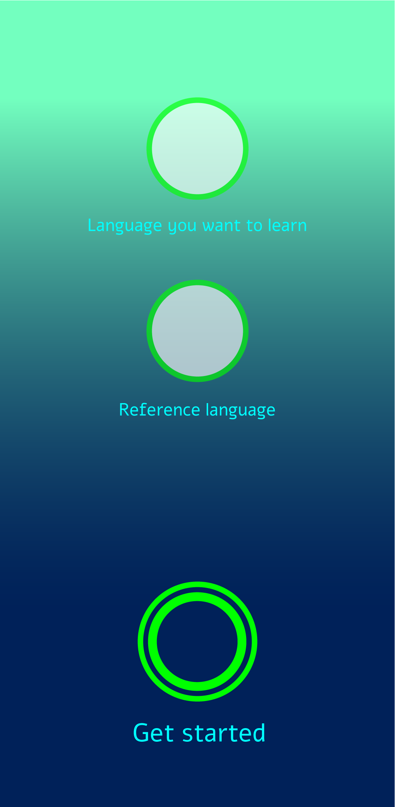
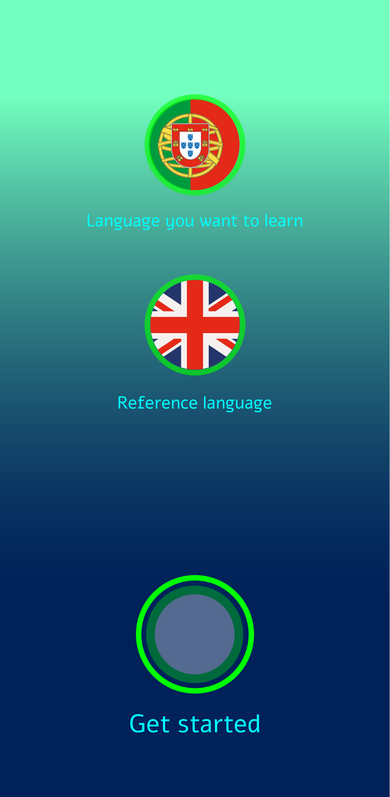
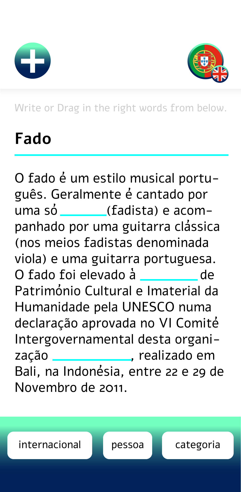
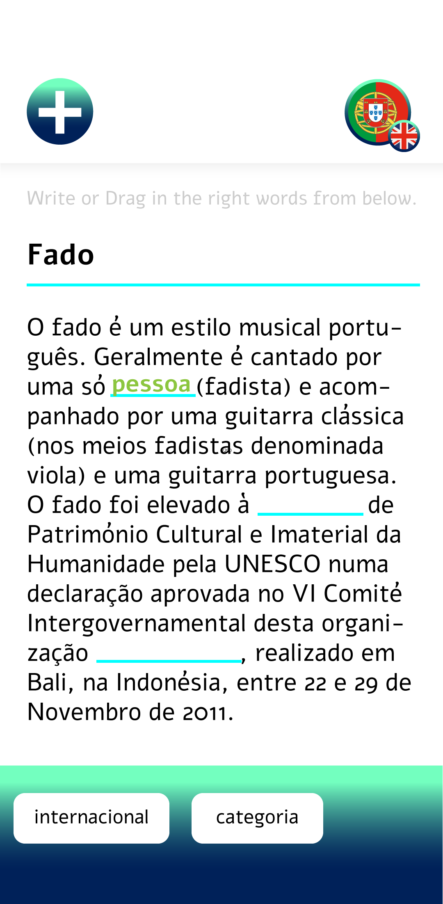
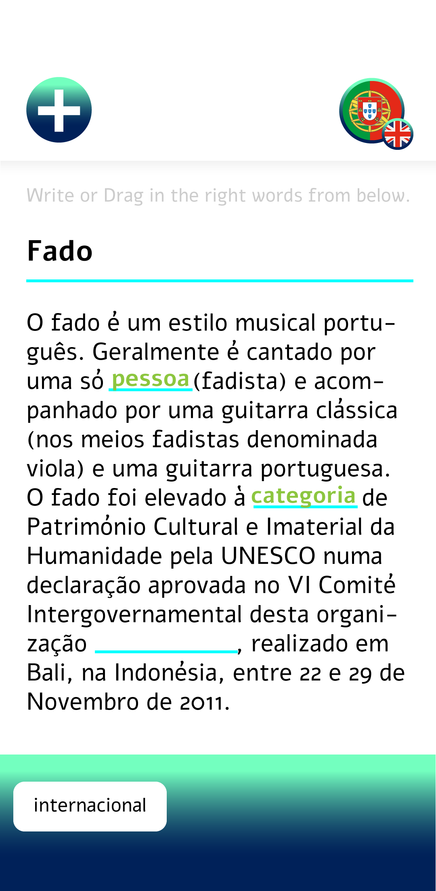
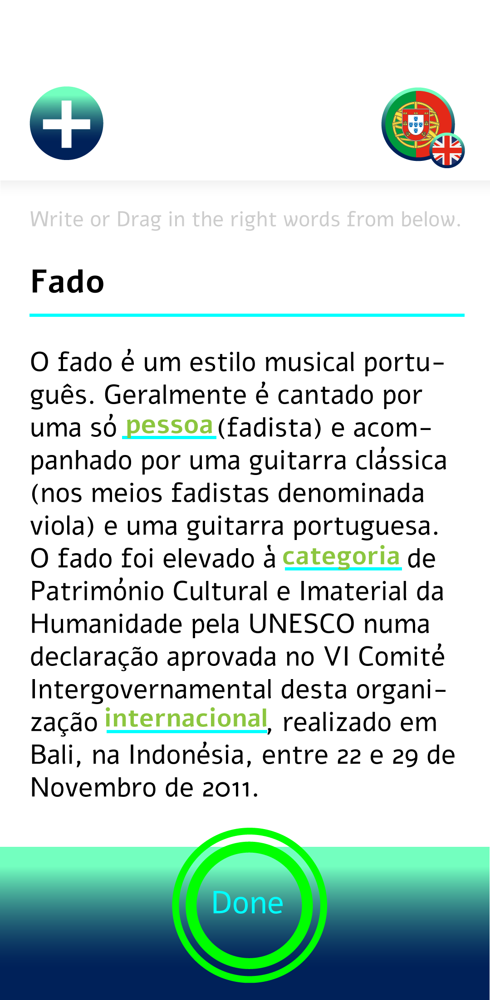
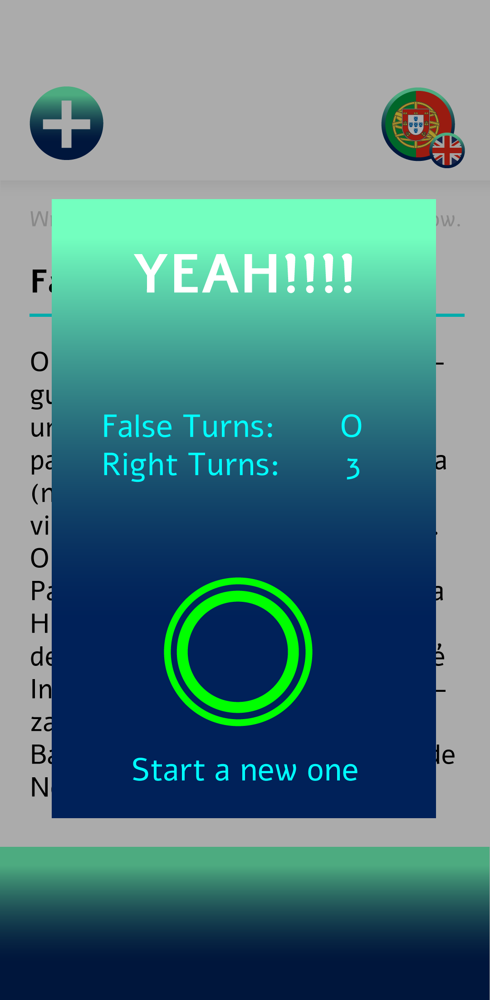

# Learning Language App

**Learning Language App by Amélie Yaacoub | 6. Semester | [Interactive Media Design](https://imd.mediencampus.h-da.de/) | SoSe 2020**

### The idea was created during a coding project in my 6 semester Interactive Media Design.
A language app which shows a randomly article from wikipedia and picks randomly a few words out of it.
The User sees the article with the empty spaces and a list of the missing words.
The goal is to write the right word in the right space.

### Personal Goals

- Write an app from scratch.
- Do Back & Front End, where as personally the difficulty is on backend.
- Practicing and getting more into Java.
- I always wanted to make a project with languages.
- Get to know Android Studio.

## Mock-Up's

 

  

 
